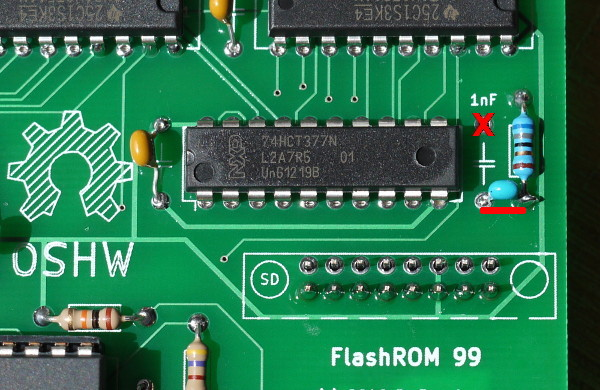

Fixing Disk Issues for Revision 1 Boards
========================================

Revision 1 (and 1a) of the FlashROM 99 board has a small issue that results
in unreliable disk access on some, but not all systems with certain disk
controllers.

This document describes a simple fix that converts a Revision 1/1a board
into a Revision 2 board that fixes the disk issue for all systems.

*IMPORTANT:* Make sure you have a Revision 1/1a board by checking the lower
right-hand side of your cartridge board first!

Also note that a fixed Revision 1/1a board is identical to a Revision 2
board.  There is no need to exchange boards or carts.

Method 1: Cut Trace
-------------------

Turn over your Revision 1/1a board and locate the traces that connect the
capacitor to the resistor.  You basically need to connect the end of the
capacitor that is connected to the resistor to the *other* end of the
resistor.

Fortunately, this is easily done: First, use an exacto knife to cut the
trace marked by the red line.  When done, use a volt meter to verify that
the connection has been severed.  Second, solder a short wire between the
pins marked by the yellow line.

Method 1 is particularly suited for assembled boards, although method 2 will
work just as well.

Method 2: Rotate Capacitor
--------------------------

Locate the position of the 1 nF capacitor capacitor on the board.  Instead
of placing the capacitor as indicated, connect one wire to the resistor
instead.

Connect one wire of the capacitor to its regular, lower terminal, but
connect the other wire to the resistor instead.  The upper terminal of the
capacitor must not be connected.

If you find it difficult to connect the capacitor to the resistor you may
also put either component on the backside of the cart.

Method 2 is particularly suited for bare boards that are about to be
assembled, although method 1 will work just as well.

Note
----

You do not need to perform either modification if you don't use programs
that access the disk drives, or if you do not experience any issues with
your already assembled board.

Thanks go to Jim Fetzner for pointing out the flawed wiring in Revision 1.
